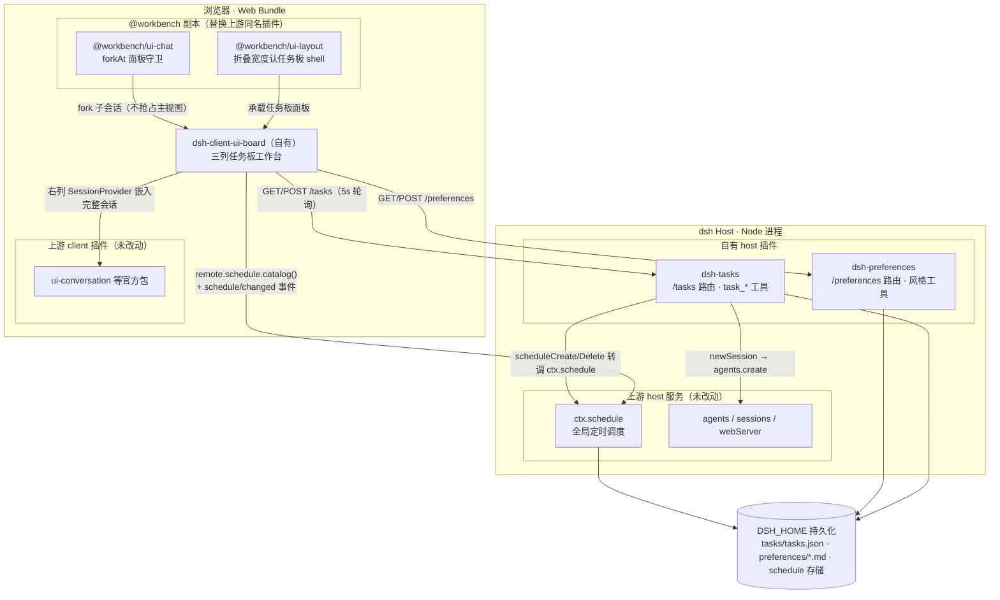

# DeepSeek Harness

English | [中文](README.zh.md)

DeepSeek Harness (`dsh`) is an open-source agent harness developed by [DeepSeek AI](https://deepseek.com).

It is built on an **everything-is-a-plugin** architecture and powered by [Cordis](https://github.com/cordiverse/cordis), whose design is described in [_A Programming Paradigm for Spatiotemporal Composability_](https://arxiv.org/abs/2608.25512).

Documentation: [https://deepseek-harness.github.io/deepseek-harness/](https://deepseek-harness.github.io/deepseek-harness/)

## This fork: personal workbench

This repository forks [deepseek-ai/deepseek-harness](https://github.com/deepseek-ai/deepseek-harness) at upstream `0.2.1-alpha.1` (`5badb15`); all customization lives on the [`personal-workbench`](https://github.com/qaz2883383/deepseek-harness/tree/personal-workbench) branch. **No upstream package is modified**: patched packages ship as `@workbench/*` copies that the web bundle loads in place of their upstream names, which keeps upstream syncs diffable. The remaining sections below are the original upstream README.

### Purpose

Turn dsh from a general session-oriented agent workbench into a **personal daily-work management hub**:

- **Tasks as first-class entities**: a sticky-note wall, plan items with closure dates, progress notes, work/learning categories, pinning, and running-state indicators.
- **Every session belongs to exactly one task**: unassigned conversations fall into the catch-all "其它" task, a conversation is that task's work log, and forked children rejoin the source task automatically.
- **A time dimension**: the board's calendar aggregates plan deadlines and scheduled reminders, with create/cancel actions inline.
- **Reply-style preferences**: standing work/learning profiles selected per conversation and injected as runtime context.

### Architecture



### What changed

| Location | Kind | Changes |
|---|---|---|
| `packages/context/tasks/` | own host plugin | `/tasks` route (token-guarded): task CRUD, newSession/attachSession, scheduleCreate/Delete forwarding to `ctx.schedule`; `task_create / task_update / task_start / task_list` tools (update goes through a before/after user review with a 180-second timeout); single-task-per-session enforcement plus an undeletable catch-all task |
| `packages/context/preferences/` | own host plugin | `/preferences` route; `reply_style` (per-conversation work/learning selection) and `update_preference` (append a standing instruction) tools; the selected profile is injected as systemPrompt context |
| `packages/client/ui-board/` | own client plugin | three-column workbench: task sticky notes (running/overdue/done indicators, category badges, progress, pinning), task detail plus calendar (deadline and reminder dots, create/cancel reminders), and an embedded full conversation (chat directly); fork follow-along and task inheritance; system-notification permission toggle; draggable column widths |
| `packages/client/ui-chat-workbench/` | `@workbench/ui-chat` copy | full copy of upstream `dsh-client-ui-chat`; single patch: `forkAt` no longer calls `openSession` to seize the main view while a feature panel owns it (`activePanelId` guard) |
| `packages/client/ui-layout-workbench/` | `@workbench/ui-layout` copy | full copy of upstream `dsh-client-ui-layout`; single patch: `AppFrame`'s `collapsedWidth` recognizes the task-board shell attribute |
| `packages/bundle/web-app/` | composition wiring | `cordis.patch.yml`: host rows add preferences/tasks, client rows add ui-board, and the ui-layout/ui-chat rows now point at the `@workbench/*` copies; `package.json` gains the workspace dependencies |
| root configs | build wiring | `tsconfig.base/host/client.json` paths and references; `pnpm-workspace.yaml` overrides pin the micromark family (the npm mirror registry drifts them, which breaks types) |
| `scripts/` | helpers | `dump-one-session.mts`, `dump-rtc.mts`, `inspect-task-sessions.mts` session-inspection scripts |
| `docs/personal-workbench-devlog.md` | docs | full development log (v1 through v17, including verification records) |

### Building and syncing upstream

- Build order (client type-checking depends on the `/remote` contracts that the host-face tsdown generates): `tsc host → tsdown host → tsc client → tsdown client → pnpm run build:web`, or simply `pnpm run build`.
- Syncing upstream: `git fetch upstream` and merge, then diff each `@workbench/*` copy against its upstream namesake and re-apply the patch points documented in that copy's README.

## Developer preview

DeepSeek Harness is in _developer preview_ and iterating rapidly. **THERE WILL BE COMPATIBILITY-BREAKING CHANGES.**

Review the [safety notice](SAFETY.md) before running the project.

## Run

### Run from `npm`

Install `Node.js`, then run:

```sh
npx @deepseek-ai/dsh web
```

The command starts the Web UI at `http://127.0.0.1:3080` by default and opens it in the default browser for a local launch. An SSH launch only prints the host URL because the SSH client or editor owns the local forwarded address. Pass `--no-open` to run the server without opening a browser. See [Web UI guide](docs/user/guide/index.md).

### Run from source

To run from a repository checkout:

```sh
git clone https://github.com/deepseek-ai/deepseek-harness.git
cd deepseek-harness
pnpm install
pnpm run build
pnpm dsh web
```

`pnpm run build` prepares the repository artifacts. `pnpm dsh web` uses those built artifacts without rebuilding.

## Community and support

- Submit feedback or bug reports through [GitHub Discussions](https://github.com/deepseek-ai/deepseek-harness/discussions).
- Add the [`dsh-plugin`](https://github.com/topics/dsh-plugin) topic to your plugin repository for discoverability.
- Join <a href="https://discord.gg/4MrtZUhpxg">DeepSeek Harness Discord community</a>.

## Contributing

See [CONTRIBUTING.md](CONTRIBUTING.md).

## Development

Start with the [development guide](docs/development.md) and [architecture documentation](docs/architecture.md).

`pnpm run dev:web` builds, serves, and rebuilds client bundles on source edits in one terminal, and `make help` lists the matching Make targets for Web and Desktop; the guide's application commands section owns the full table.

For agents, follow [AGENTS.md](AGENTS.md).

## Citation

```bibtex
@misc{deepseek-harness2026,
  title={DeepSeek Harness: Everything is a Plugin},
  author={DeepSeek-AI},
  year={2026},
  publisher={GitHub},
  howpublished={\url{https://github.com/deepseek-ai/deepseek-harness}},
}
```

## License

[MIT](LICENSE)

Third-party dependencies and their licenses are disclosed in [THIRD_PARTY_NOTICES.md](THIRD_PARTY_NOTICES.md).
