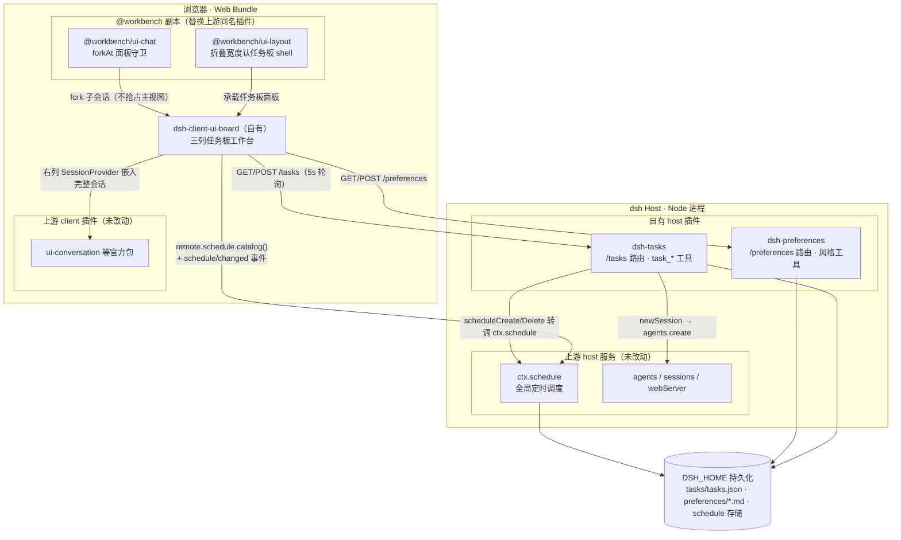

# DeepSeek Harness

[English](README.md) | 中文

DeepSeek Harness（`dsh`）是由 [DeepSeek AI](https://deepseek.com) 开发的开源 agent harness（智能体框架）。

它构建于**一切皆插件**的架构之上，由 [Cordis](https://github.com/cordiverse/cordis) 驱动，其设计参见论文 [_A Programming Paradigm for Spatiotemporal Composability_](https://arxiv.org/abs/2608.25512)。

文档：[https://deepseek-harness.github.io/deepseek-harness/](https://deepseek-harness.github.io/deepseek-harness/)

## 本仓库：个人工作台定制

本仓库 fork 自 [deepseek-ai/deepseek-harness](https://github.com/deepseek-ai/deepseek-harness)，基线为上游 `0.2.1-alpha.1`（`5badb15`）；全部定制位于 [`personal-workbench`](https://github.com/qaz2883383/deepseek-harness/tree/personal-workbench) 分支。**上游包零改动**：被修改的包以 `@workbench/*` 副本形式存在，由 web bundle 换行加载、替换同名上游插件，方便与上游同步。以下其余章节为上游原始 README。

### 定制目的

把 dsh 从通用"会话式 agent 工作台"改造成**个人日常工作管理中枢**：

- **任务为一级实体**：便签墙视图、计划条目（含闭环日期）、进展记录、工作/学习分类、置顶、运行状态指示灯。
- **会话单一归属任务**：每个会话恰好属于一个任务（未指定则归入"其它"兜底任务），对话即该任务的工作记录；fork 出的子会话自动归入源任务。
- **时间维度**：任务板内置日历，聚合计划闭环日期与定时提醒，可直接创建/取消提醒。
- **回复风格偏好**：工作/学习两类长期档案，按会话选择后注入运行时上下文。

### 定制架构



### 改动细节

| 位置 | 类型 | 内容 |
|---|---|---|
| `packages/context/tasks/` | 自有 host 插件 | `/tasks` 路由（token 守卫）：任务 CRUD、newSession/attachSession、scheduleCreate/Delete 转调 `ctx.schedule`；`task_create / task_update / task_start / task_list` 工具（update 带修改前后对比的用户审核，180 秒超时）；会话单一归属强约束，"其它"兜底任务不可删除 |
| `packages/context/preferences/` | 自有 host 插件 | `/preferences` 路由；`reply_style`（按会话选择 work/learning）与 `update_preference`（追加长期指令）工具；选中档案注入 systemPrompt 上下文 |
| `packages/client/ui-board/` | 自有 client 插件 | 三列工作台：左列任务便签（运行/逾期/完成指示灯、类别徽章、进度、置顶），中列任务详情与日历（deadline 与提醒点、新建/取消提醒），右列嵌入完整会话（可直接对话）；fork 跟随与归属；🔔 系统通知授权；三列宽度可拖动 |
| `packages/client/ui-chat-workbench/` | `@workbench/ui-chat` 副本 | 上游 `dsh-client-ui-chat` 全量复制；唯一补丁：`forkAt` 在功能面板持有主视图时不再 `openSession` 抢占（`activePanelId` 守卫） |
| `packages/client/ui-layout-workbench/` | `@workbench/ui-layout` 副本 | 上游 `dsh-client-ui-layout` 全量复制；唯一补丁：`AppFrame` 的 `collapsedWidth` 识别任务板 shell 属性 |
| `packages/bundle/web-app/` | 组合接线 | `cordis.patch.yml`：host 行新增 preferences/tasks、client 行新增 ui-board，ui-layout/ui-chat 行改指 `@workbench/*` 副本；`package.json` 增补 workspace 依赖 |
| 根目录配置 | 构建接线 | `tsconfig.base/host/client.json` 路径与引用；`pnpm-workspace.yaml` overrides 钉住 micromark 三件套（npm 镜像解析漂移会导致类型冲突） |
| `scripts/` | 辅助工具 | `dump-one-session.mts`、`dump-rtc.mts`、`inspect-task-sessions.mts` 会话检查脚本 |
| `docs/personal-workbench-devlog.md` | 文档 | 完整开发日志（v1 → v17，含验证记录） |

### 构建与同步上游

- 构建顺序（client 类型检查依赖 host 面 tsdown 生成的 `/remote` 契约）：`tsc host → tsdown host → tsc client → tsdown client → pnpm run build:web`，或直接 `pnpm run build`。
- 同步上游：`git fetch upstream` 后合并；将各 `@workbench/*` 副本与上游同名包 diff 对照，按副本 README 记录的补丁点重放。

## 开发者预览

DeepSeek Harness 处于 _开发者预览_ 阶段，正在快速迭代。**未来将出现破坏兼容性的变更。**

运行本项目前，请阅读[安全说明](SAFETY.zh.md)。

<a id="run"></a>

## 运行

### 通过 `npm` 运行

安装 `Node.js`，然后运行：

```sh
npx @deepseek-ai/dsh web
```

该命令默认会在 `http://127.0.0.1:3080` 启动 Web UI，本机启动时还会用默认浏览器打开页面。通过 SSH 启动时只打印宿主机 URL，因为本地转发地址由 SSH 客户端或编辑器持有。传入 `--no-open` 可仅运行服务器而不打开浏览器。详见 [Web UI 指南](docs/user/guide/index.zh.md)。

<a id="run-from-source"></a>

### 从源码运行

如需从仓库源码运行：

```sh
git clone https://github.com/deepseek-ai/deepseek-harness.git
cd deepseek-harness
pnpm install
pnpm run build
pnpm dsh web
```

`pnpm run build` 会准备仓库产物。`pnpm dsh web` 会直接使用这些已构建产物，不会重新构建。

## 社区与支持

- 通过 [GitHub Discussions](https://github.com/deepseek-ai/deepseek-harness/discussions) 提交反馈或 bug 报告。
- 为你的插件仓库添加 [`dsh-plugin`](https://github.com/topics/dsh-plugin) 话题，便于被发现。
- 欢迎加入 DeepSeek Harness 企微群！扫描下方二维码填写入群问卷，小助手会定期发送入群邀请。

<table>
  <thead>
    <tr>
      <th align="center">入群问卷</th>
      <th align="center">微信公众号</th>
    </tr>
  </thead>
  <tbody>
    <tr>
      <td align="center"><a href="https://trtgsjkv6r.feishu.cn/share/base/form/shrcnIt5twSVdLGD52KJBckGCgg"></a></td>
      <td align="center"></td>
    </tr>
  </tbody>
</table>

## 参与贡献

参见 [CONTRIBUTING.md](CONTRIBUTING.zh.md)。

## 开发

请先阅读[开发指南](docs/development.zh.md)与[架构文档](docs/architecture.zh.md)。

`pnpm run dev:web` 会在一个终端里完成构建、启动，并在源码修改时重建 client bundle；`make help` 列出 Web 与 Desktop 对应的 Make target。完整表格见开发指南的「应用命令」一节。

面向 agent：请遵循 [AGENTS.md](AGENTS.md)。

## 引用

```bibtex
@misc{deepseek-harness2026,
  title={DeepSeek Harness: Everything is a Plugin},
  author={DeepSeek-AI},
  year={2026},
  publisher={GitHub},
  howpublished={\url{https://github.com/deepseek-ai/deepseek-harness}},
}
```

## 许可证

[MIT](LICENSE)

第三方依赖及其许可证见 [THIRD_PARTY_NOTICES.md](THIRD_PARTY_NOTICES.md)。
